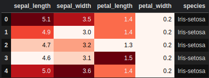

# 机器学习大作业

姓名：李康峰

学号：2201400216

班级：22工试2

## 描述数据集

选取 Iris 花卉分类数据集。该数据集含有 150 条数据，每条数据含有 5 个字段。其中没有无效数据，含有三条重复数据。去除重复数据后剩余 147 条。



该数据集含有三类，分别为 `Iris-setosa`, `Iris-versicolor`, `Iris-virginica`，三种类别的数据量接近均等，如图


根据数据均值绘制图像：


将输入数据映射到二维绘制图表


## 使用 BP 网络分类

### 定义 BP 网络


尝试了 `ReLU`, `Sigmoid`, `Tanh` 作为激活函数，并尝试了单层，双层和三层网络，训练30轮后分类准确度如下表

| -    | ReLU   | Sigmoid | Tanh   |
| ---- | ------ | ------- | ------ |
| 单层 | 90%    | 66.67%  | 63.33% |
| 双层 | 93.33% | 63.33%  | 86.67% |
| 三层 | 83.33% | 33.33%  | 76.67% |

训练100轮后分类准确度如下

| -    | ReLU   | Sigmoid | Tanh   |
| ---- | ------ | ------- | ------ |
| 单层 | 100%   | 96.67%  | 100%   |
| 双层 | 86.67% | 93.33%  | 86.67% |
| 三层 | 83.33% | 63.33%  | 80.00% |

### 影响

对于Iris 数据集，ReLU 和 Tanh 在单层网络中表现最佳。ReLU 在单层网络中达到了100%的准确度，但在多层网络中效果不如单层网络。Tanh 在单层网络中表现也非常好，而 Sigmoid 的表现相对不如前两者。

单层网络在这个任务中表现最佳，随着层数增加，网络的性能并没有提升，反而有所下降。

## 朴素贝叶斯分类

分类结果：


### 和BP网络对比

通过比较朴素贝叶斯分类器和 BP 神经网络在 Iris 数据集上的分类结果，可以看到它们的性能和适用场景的不同。下面我们详细比较它们：

#### 朴素贝叶斯分类器

- **测试准确率**：100%
- **分类报告**：
  
  - 精确度、召回率和 F1-score 均为 1.00。
- **混淆矩阵**：
  ```
  [[10  0  0]
   [ 0  9  0]
   [ 0  0 11]]
  ```
- **优点**：
  - 简单快速，计算效率高。
  - 对小规模数据集效果很好。
  - 对特征独立性假设的敏感度较低。
- **缺点**：
  - 特征独立性假设在实际应用中通常不成立。
  - 对于复杂数据集，可能表现不如复杂模型。

#### BP 神经网络

- **测试准确率（100轮后）**：
  - 单层 ReLU：100%
  - 单层 Sigmoid：96.67%
  - 单层 Tanh：100%
  - 双层 ReLU：86.67%
  - 双层 Sigmoid：93.33%
  - 双层 Tanh：86.67%
  - 三层 ReLU：83.33%
  - 三层 Sigmoid：63.33%
  - 三层 Tanh：80.00%
- **优点**：
  - 强大的拟合能力，适用于复杂数据集和非线性关系。
  - 可通过调整网络结构和超参数优化性能。
- **缺点**：
  - 训练时间较长，计算资源消耗大。
  - 需要更多的数据进行有效训练。
  - 需要精心调整超参数和网络结构。
  

#### 比较分析

1. **准确率**：
   - 在 Iris 数据集上，朴素贝叶斯分类器和最佳配置的 BP 神经网络（单层 ReLU 或单层 Tanh）都达到了 100% 的测试准确率。

2. **训练时间和资源**：
   - 朴素贝叶斯分类器训练时间极短，计算资源消耗低，非常高效。
   - BP 神经网络训练时间较长，尤其是层数增加时，需要更多的计算资源。

3. **模型复杂度**：
   - 朴素贝叶斯分类器结构简单，容易实现和理解。
   - BP 神经网络结构复杂，灵活性更高，但需要更多的经验和技巧进行调优。

4. **适用性**：
   - 对于简单、独立特征的数据集，朴素贝叶斯分类器效果很好。
   - 对于复杂数据集和需要捕捉非线性关系的任务，BP 神经网络更为合适。

#### 总结

对于 Iris 数据集这样相对简单的数据集，朴素贝叶斯分类器和 BP 神经网络都能取得很好的结果，甚至达到 100% 的准确率。但在实际应用中，选择合适的模型需要综合考虑数据集的复杂性、计算资源和时间等因素。朴素贝叶斯分类器适合简单任务和快速原型设计，而 BP 神经网络则适合更复杂的任务和需要高精度的应用。


## 附源码

### 绘制图表

```python
sns.set_style("whitegrid")
sns.pairplot(iris,hue="species",size=3);

plt.gcf().patch.set_facecolor('mistyrose')
plt.show()  
```

### 训练 BP 网络

```python
# 构建BP神经网络模型
model = Sequential()

model.add(Dense(10, input_dim=4, activation='relu'))
model.add(Dense(10, activation=act))
model.add(Dense(3, activation='softmax'))

model.compile(optimizer='sgd', loss='categorical_crossentropy', metrics=['accuracy'])

model.fit(X_train, y_train, epochs=100, batch_size=5, verbose=1)

loss, accuracy = model.evaluate(X_test, y_test, verbose=0)
print(f'Test Accuracy: {accuracy:.4f}')
```

### 朴素贝叶斯网络

```python
gnb = GaussianNB()

gnb.fit(X_train, y_train)

y_pred = gnb.predict(X_test)

accuracy = accuracy_score(y_test, y_pred)
print(f'Test Accuracy: {accuracy:.4f}')
print("\nClassification Report:")
print(classification_report(y_test, y_pred))
print("\nConfusion Matrix:")
print(confusion_matrix(y_test, y_pred))
```


